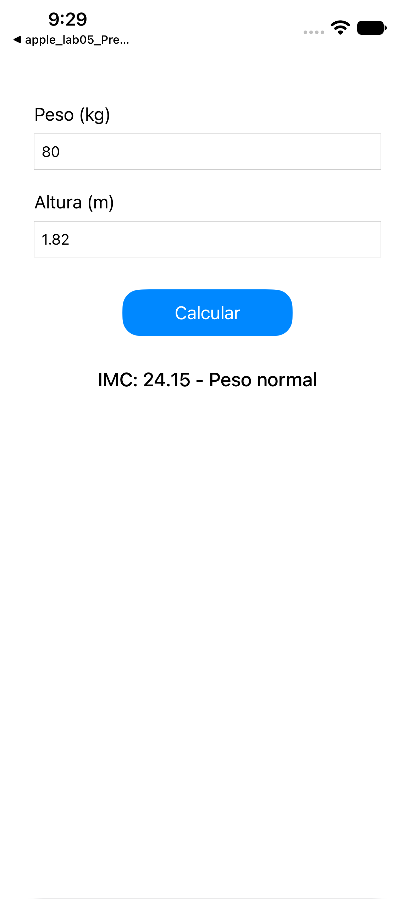
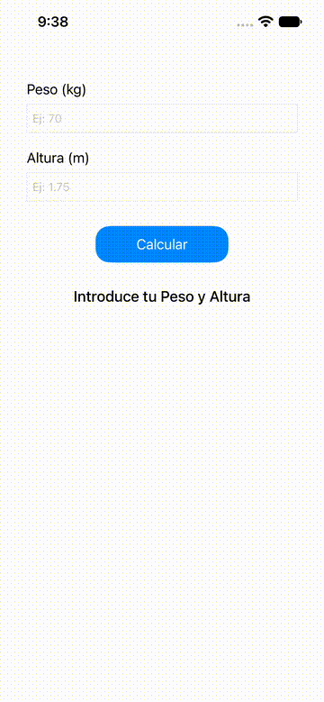
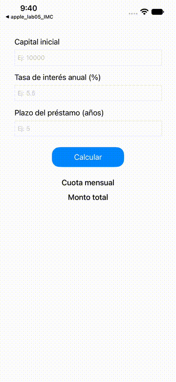

# Laboratorio 05 - Interfaces mediante UIKit

**Curso:** Programación en Móviles Avanzado  
**Laboratorio:** 05  
**Tema:** Interfaces mediante UIKit  
**Tecnologías:** Swift · UIKit · Storyboard · Auto Layout  
**Entorno de ejecución:** Xcode · iOS Simulator  
**Dispositivo de prueba:** iPhone 17e  

---

## Objetivo

Desarrollar interfaces para aplicaciones iOS utilizando UIKit y Storyboard, aplicando controles básicos, Auto Layout y conexión entre los componentes visuales y `UIViewController`.

Durante el laboratorio se desarrollaron tres bloques principales:

1. Introducción a UIKit y Auto Layout.
2. Calculadora de Índice de Masa Corporal (IMC).
3. Actividad de Calculadora de Préstamos.

---

# 1. Introducción a UIKit

**Proyecto:** `apple_lab05_UIKit_intro`

En este primer ejercicio se creó una aplicación básica utilizando UIKit y Storyboard.

Se incorporaron dos elementos `UILabel`:

- `Diseño y Desarrollo de Software`
- `Ortiz`

El segundo label utiliza un fondo visible y una fuente de mayor tamaño.

Posteriormente se aplicaron restricciones de Auto Layout para mantener correctamente la ubicación de los elementos al cambiar la orientación del dispositivo.

## Vista Portrait


La interfaz mantiene ambos elementos centrados y correctamente posicionados dentro del área segura del dispositivo.

## Vista Landscape


Al cambiar a orientación horizontal, Auto Layout mantiene la distribución de los elementos sin producir superposiciones o desplazamientos fuera de la pantalla.

---

# 2. Calculadora de IMC

**Proyecto:** `apple_lab05_IMC`

El segundo proyecto utiliza controles básicos de UIKit para calcular el Índice de Masa Corporal de una persona.

La aplicación contiene:

- `UILabel` para indicar peso y altura.
- `UITextField` para ingresar los valores.
- `UIButton` para ejecutar el cálculo.
- `UILabel` para presentar el resultado.

Los controles se conectaron con `ViewController` mediante `IBOutlet` e `IBAction`.

## Fórmula

El IMC se calcula mediante:

```text
IMC = peso / altura²
```

Las clasificaciones utilizadas son:

| IMC | Clasificación |
|---|---|
| Menor a 18.5 | Bajo peso |
| Menor a 24.9 | Peso normal |
| Menor a 29.9 | Sobrepeso |
| Igual o mayor a 29.9 | Obesidad |

## Interfaz inicial


La aplicación solicita el peso en kilogramos y la altura en metros.

## Ejecución del cálculo

Caso utilizado:

```text
Peso: 70 kg
Altura: 1.75 m
```

Resultado:

```text
IMC: 22.86 - Peso normal
```



## Validación de datos

La aplicación también verifica que el peso y la altura sean valores válidos antes de realizar el cálculo.


## Demostración de funcionamiento



---

# 3. Calculadora de Préstamos

**Proyecto:** `apple_lab05_Prestamos`

Como actividad final se desarrolló una calculadora de préstamos utilizando UIKit.

La aplicación permite ingresar:

- Capital inicial.
- Tasa de interés anual.
- Plazo del préstamo en años.

Posteriormente calcula:

- Cuota mensual.
- Monto total a pagar.

## Variables utilizadas

```text
P = capital inicial
r = tasa de interés mensual
n = número total de pagos
M = cuota mensual
```

La tasa mensual se obtiene mediante:

```text
r = (tasaAnual / 100) / 12
```

El número total de pagos se calcula mediante:

```text
n = años × 12
```

La cuota mensual utiliza la fórmula de amortización:

```text
        r(1 + r)^n
M = P × -----------
       (1 + r)^n - 1
```

Finalmente:

```text
Monto total = M × n
```

## Interfaz inicial


La interfaz permite ingresar los tres datos necesarios para realizar el cálculo.

## Ejecución con interés

Caso utilizado:

```text
Capital inicial: S/ 10000
Tasa anual: 12 %
Plazo: 1 año
```

Resultado:

```text
Cuota mensual: S/ 888.49
Monto total: S/ 10661.85
```


## Caso con tasa de interés 0 %

También se implementó el tratamiento para una tasa igual a cero, evitando divisiones inválidas dentro de la fórmula de amortización.

Caso utilizado:

```text
Capital inicial: S/ 12000
Tasa anual: 0 %
Plazo: 1 año
```

Resultado:

```text
Cuota mensual: S/ 1000.00
Monto total: S/ 12000.00
```


## Demostración de funcionamiento



---

# 4. Validaciones implementadas

## Calculadora de IMC

Se verifica que:

- el peso sea distinto de cero;
- la altura sea distinta de cero;
- los campos puedan convertirse correctamente a valores numéricos.

En caso contrario se muestra:

```text
Por favor, ingresa valores válidos.
```

## Calculadora de Préstamos

Se verifica que:

```text
capital > 0
tasa anual >= 0
plazo > 0
```

En caso de datos inválidos se muestra:

```text
Ingrese valores válidos.
```

Además, cuando la tasa anual es igual a `0 %`, se utiliza:

```text
cuota mensual = capital / número de pagos
```

evitando divisiones por cero.

---

# 5. Verificación de compilación

Los tres proyectos fueron compilados mediante `xcodebuild` y ejecutados posteriormente en iOS Simulator.

| Proyecto | Build | Ejecución |
|---|---|---|
| `apple_lab05_UIKit_intro` | ✅ BUILD SUCCEEDED | ✅ Correcta |
| `apple_lab05_IMC` | ✅ BUILD SUCCEEDED | ✅ Correcta |
| `apple_lab05_Prestamos` | ✅ BUILD SUCCEEDED | ✅ Correcta |

Las aplicaciones fueron verificadas utilizando un simulador **iPhone 17e**.

---

# 6. Estructura de SEMANA05

```text
SEMANA05/
├── apple_lab05_UIKit_intro/
│   └── apple_lab05_UIKit_intro.xcodeproj
│
├── apple_lab05_IMC/
│   └── apple_lab05_IMC.xcodeproj
│
├── apple_lab05_Prestamos/
│   └── apple_lab05_Prestamos.xcodeproj
│
├── evidencias/
│   ├── uikit/
│   │   ├── 01-uikit-portrait.png
│   │   └── 02-uikit-landscape.png
│   │
│   ├── imc/
│   │   ├── 01-imc-interfaz.png
│   │   ├── 02-imc-peso-normal.png
│   │   └── 03-imc-validacion.png
│   │
│   ├── prestamos/
│   │   ├── 01-prestamos-interfaz.png
│   │   ├── 02-prestamos-calculo.png
│   │   └── 03-prestamos-tasa-cero.png
│   │
│   └── gifs/
│       ├── imc-demo.gif
│       └── prestamos-demo.gif
│
└── README.md
```

---

# 7. Conclusiones

- UIKit permitió crear interfaces gráficas mediante controles visuales y Storyboard.
- Auto Layout permitió mantener correctamente la posición de los elementos en orientaciones Portrait y Landscape.
- Las conexiones `IBOutlet` permitieron acceder desde Swift a los controles definidos en Storyboard.
- Las acciones `IBAction` permitieron ejecutar funciones a partir de la interacción del usuario.
- La calculadora de IMC permitió aplicar captura de datos, validación, operaciones matemáticas y presentación de resultados.
- La calculadora de préstamos permitió aplicar una fórmula de amortización utilizando capital, tasa de interés y plazo.
- Se consideraron casos especiales, como entradas inválidas y préstamos con tasa de interés igual a cero.
- Los tres proyectos fueron compilados y ejecutados correctamente utilizando iOS Simulator.

---

## Autor

**Ortiz**  
Programación en Móviles Avanzado  
TECSUP
